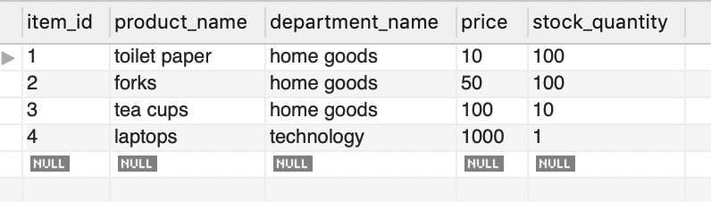
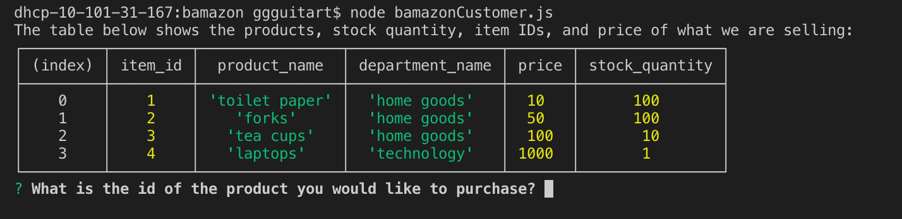
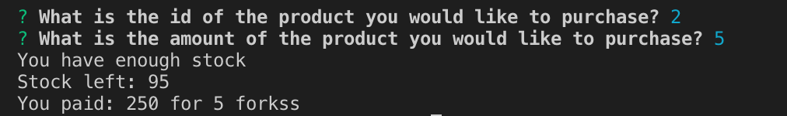

# bamazon
The intention of this program is to create a system that works some what similarly to Amazon.com. The purpose is to allow the user to input the ID of a product they'd like to buy and the amount they'd like to buy. Once completed, the program will check the database to see if there is enough of that product for the user to purchase, and if so will output the amount left as well as the cost for the user to buy that amount of a certain product. 

In this I used I developed a table on MySQL

Then I used Javascript and coded using node modules to allow for the user to get an updated table of the products and amounts of each product after running the function.

Finally I used inquierer packages to allow for the user to input which product they'd like to purchase and the amount they'd like to purchase. Which out output the item, the price, and the updated stock for the store.

